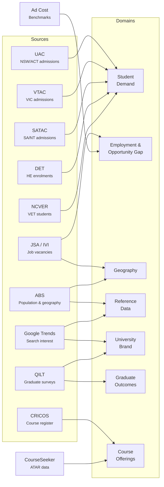
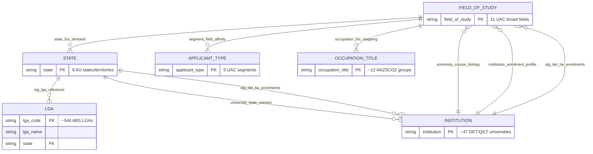
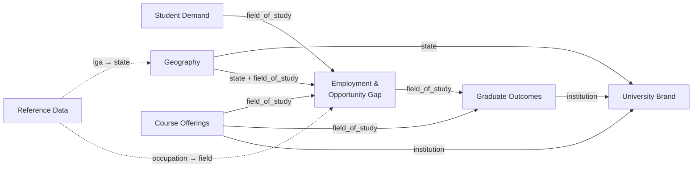

# Entity Relationships & Data Lineage

## Data Source Flow

How external data sources feed into the seven analytical domains.

## Entity-Relationship Diagram

## Domain Connectivity

### How the domains work together

Each domain answers a piece of the marketing puzzle. The power comes from connecting them:

- **Student Demand + Employment & Opportunity Gap** — We know what students *want* to study (from admissions data) and where employers *need* graduates (from job vacancy data). The gap between the two reveals which fields have strong employer demand but low student interest — your strongest recruitment messaging opportunities.

- **Employment & Opportunity Gap + Graduate Outcomes** — A field with high demand is even more compelling when graduates also have high employment rates and strong salaries. Combining these lets us classify fields into tiers: "no-brainer" fields that are strong on every dimension, vs fields where the story needs more nuance.

- **Graduate Outcomes + University Brand** — We can compare a university's academic quality and graduate employment against its public search interest. Universities that rank well on quality but low on search interest have the clearest case for marketing investment — strong product, weak awareness.

- **Geography + everything else** — Every insight can be localised. We know which states have the highest graduate job demand per capita, which fields dominate in which states, and where youth populations are most concentrated — down to the Local Government Area. This turns national insights into targeted, location-specific campaigns.

- **Course Offerings** — Connects specific programs at specific campuses back to all of the above. Instead of "Engineering has a 12% opportunity gap", we can say "Your Bachelor of Civil Engineering at your Sydney campus is in a field with 12% more employer demand than student interest, 87% full-time employment, and $78K median salary."

## Join Paths

The table below shows how to join between any two domains using shared entities.

| From Domain | To Domain | Join Key | Join Path | Notes |
|---|---|---|---|---|
| Student Demand | Employment & Opportunity Gap | `field_of_study` | Direct join | Core opportunity gap calculation |
| Student Demand | Graduate Outcomes | `field_of_study` | Direct join | Preference + outcomes context |
| Student Demand | Geography | `field_of_study` + `state` | Via `state_fos_demand` | State-level demand by field |
| Employment & Opportunity Gap | Graduate Outcomes | `field_of_study` | Direct join | Demand + outcomes for value scoring |
| Employment & Opportunity Gap | Geography | `field_of_study` + `state` | Via `state_fos_demand` | State-level vacancy patterns |
| Graduate Outcomes | University Brand | `institution` | `institution_scorecard` → `university_brand_awareness` | Quality metrics + brand interest |
| University Brand | Geography | `state` | Via `university_state_interest` | Geographic brand presence |
| Course Offerings | Employment & Opportunity Gap | `field_of_study` | `uac_field_of_study` → `field_of_study` | Course-level opportunity context |
| Course Offerings | Graduate Outcomes | `field_of_study` | `uac_field_of_study` → `field_of_study` | Course-level outcome context |
| Reference Data | Geography | `lga_code` → `state` | Via `stg_lga_reference` | LGA-to-state rollup |
| Student Demand (DET) | Employment & Opportunity Gap | `uac_field_of_study` | ASCED→UAC mapping in `stg_det_he_enrolments` | Enrolment volumes by field |
| Student Demand (DET) | Graduate Outcomes | `uac_field_of_study` + `institution` | Direct join | Enrolment patterns + outcomes per institution |
| Student Demand (DET) | University Brand | `institution` | Via institution entity | Enrolment mix + brand awareness |
| Student Demand (DET) | Course Offerings | `institution` + `uac_field_of_study` | Direct join | Actual enrolments vs course listings |
| Student Demand (NCVER) | Geography | `state` | Direct join | VET competition by state |
| Reference Data | Employment & Opportunity Gap | `occupation_title` → `field_of_study` | Via `occupation_fos_mapping` | Occupation-to-field crosswalk |

## Critical Crosswalks

### 1. Occupation → Field of Study Mapping

**Source:** `dagster.occupation_fos_mapping` (manual/hardcoded asset)

Maps ANZSCO2 occupation group titles to UAC fields of study. This is the bridge
between IVI job vacancy data (occupation-grain) and UAC preference data
(field-of-study-grain). Used in:
- `stg_job_vacancies_by_state_fos` — aggregates occupations to state × field
- `emerging_occupations` — enriches occupation growth with field context

**Limitation:** Many-to-one mapping (multiple occupations → one field). Not all
ANZSCO2 groups have a mapping. The mapping is manually maintained and may drift
as the occupation landscape evolves.

### 2. QILT Study Area → UAC Field of Study Mapping

**Source:** CASE statements in `stg_qilt_graduate_outcomes` and `stg_qilt_student_experience`

Maps 21 QILT study areas to 11 UAC broad fields. This is a many-to-one mapping:
for example, Medicine, Nursing, Dentistry, Pharmacy, Rehabilitation, and
Veterinary Science all map to "Health". The mapping uses SQL CASE statements
hardcoded in the staging models.

**Limitation:** Averaging across multiple QILT areas into one UAC field loses
granularity. The `qilt_areas_count` column in mart models indicates how many
QILT areas were averaged.

### 3. ASCED Broad Field → UAC Field of Study (CRICOS)

**Source:** CASE statement in `stg_cricos_courses`

Maps 2-digit ASCED broad field codes (extracted from the CRICOS `broad_field`
string) to UAC categories. Enables joining CRICOS course data with
opportunity gap and outcomes data. See also crosswalk #4 for the DET variant.

**Limitation:** "Mixed Field Programmes" (ASCED code 12) is excluded as it
has no meaningful UAC equivalent. Some ASCED→UAC mappings are approximate
(e.g. ASCED "Society and Culture" maps directly but covers a broad range).

### 4. ASCED Broad Field → UAC Field of Study (DET HE Enrolments)

**Source:** CASE statement in `stg_det_he_enrolments`

Maps DET's ASCED broad field of education names (e.g. "Natural and Physical
Sciences", "Agriculture Environmental and Related Studies") to UAC categories.
Similar to crosswalk #3 (CRICOS) but DET uses slightly different naming
conventions (e.g. no commas in "Agriculture Environmental and Related Studies"
vs ASCED code-based extraction in CRICOS).

**Limitation:** "Mixed Field Programs" and "Non-Award course" are excluded
(no UAC equivalent). DET uses 13 ASCED broad fields; after exclusions, 11 map
to UAC categories.

### 5. NCVER State Abbreviation Mapping

**Source:** `_STATE_MAP` dict in the `ncver_vet_students` Dagster asset

NCVER uses non-standard abbreviations for some states (e.g. "Vic." → VIC,
"Qld" → QLD, "Tas." → TAS). The mapping normalises these to 2-letter codes
at the asset level, so `stg_ncver_vet_students` receives clean state codes.

**Limitation:** The "Australia" national total row is included in the raw data
but filtered out in `stg_ncver_vet_students` (state-level rows can be summed).

### 6. State Name → State Code Mapping

**Source:** CASE statements in `stg_lga_reference`, `stg_google_trends_interest_by_state`

Multiple sources use different state representations:
- ABS: numeric codes (1=NSW, 2=VIC, 3=QLD, 4=SA, 5=WA, 6=TAS, 7=NT, 8=ACT)
- Google Trends: full names ("New South Wales", "Victoria", etc.)
- IVI: 2-letter codes (NSW, VIC, etc.)

All staging models normalise to 2-letter codes. The `stg_lga_reference` model
handles the ABS numeric → 2-letter mapping. The `stg_google_trends_interest_by_state`
model handles the full name → 2-letter mapping.

### 7. UAC Field Name Standardisation

**Source:** CASE statements in `stg_uac_fos_by_gender`, `stg_vtac_fos_preferences`, `stg_satac_fos_preferences`

Different admissions centres use slightly different field names:
- UAC: "Engineering & Related Tech." (abbreviated)
- VTAC: "Engineering and Related Technologies"
- SATAC: "Engineering and Related Technologies"

Staging models standardise all variants to the canonical UAC form
(e.g. "Engineering & Related Technologies") using CASE statements.

### 8. ASCED Broad Field → UAC Field of Study (QILT ESS)

**Source:** CASE statement in `stg_qilt_employer_satisfaction`

Maps QILT Employer Satisfaction Survey ASCED broad field names (e.g. "Natural
and Physical Sciences", "Agriculture, Environmental and Related Studies") to
UAC categories. Similar to crosswalk #4 (DET) — ESS uses ASCED broad field
names with commas (e.g. "Agriculture, Environmental and Related Studies")
rather than the QILT 21-study-area names used by GOS and SES.

**Limitation:** One-to-one mapping (no many-to-one aggregation needed unlike
GOS/SES study areas). "Mixed Field Programs" is not present in ESS data.

### 9. ASCED Broad Study Area → UAC Field of Study (CourseSeeker)

**Source:** CASE statement in `stg_courseseeker_atar`

Maps CourseSeeker's ASCED broad study area names (e.g. "Engineering and Related
Technologies", "Agriculture, Environmental and Related Studies") to UAC categories.
Same pattern as crosswalks #4 (DET) and #8 (ESS). CourseSeeker uses the same
ASCED naming convention as DET/ESS with commas.

**Limitation:** "Mixed Field Programmes" courses are excluded (no UAC equivalent).
Not all courses have a study area populated.
